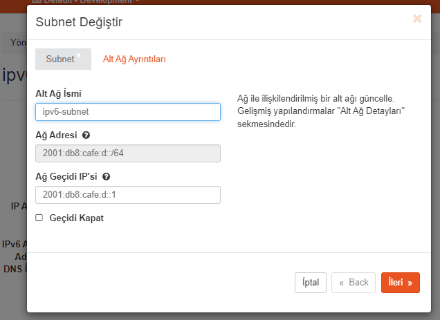

## Komutlar

Komutun etkisini dry-run görelim:
```shell
TF_LOG=DEBUG 
terraform plan
```

Komutu uygulayalım:
```shell
clear
terraform apply -var-file=vto.tfvars
```

## Açıklamalar

Bir Floatin IP rezervasyonu talebi şu şekildedir:
```json
resource "openstack_networking_floatingip_v2" "<kaynağa_erişmen_için_değişken_adı>" {
  pool = "<floating_IP_ağının_adı>"
}
```

Buradaki `public` Openstack üzerinde tanımlanmış ağın adıdır:
- 
   -  
- !
- 
   -   
   -  
   -  
   -  
   -  
- 
- 

Ve dönen cevabın gövdesi aşağıdaki gibi olacak:
```json
{
  "floatingip": {
    "created_at": "2024-04-28T23:00:41Z",
    "description": "",
    "fixed_ip_address": null,
    "floating_ip_address": "192.168.13.116",
    "floating_network_id": "34314b33-4913-4f31-8884-527b8830b022",
    "id": "f42bae1f-4cf0-4737-bf9d-4d82956e7e19",
    "port_id": null,
    "project_id": "5404f2392cee45e7a684348c371cf6db",
    "revision_number": 1,
    "router_id": null,
    "status": "DOWN",
    "tenant_id": "5404f2392cee45e7a684348c371cf6db",
    "updated_at": "2024-04-28T23:00:41Z"
  }
}
```

```shell
root@a87187fb699a:/workspace/ornekler/floating IP/create# clear && TF_LOG=DEBUG terraform apply -var-file=vto.tfvars
```


Komutunun WEB arayüzünde ayrılan kaynağın çıktısı ve konsoldaki çıktısı DEBUG modunda aşağıdaki gibidir:


```shell
2024-04-28T22:59:15.471Z [INFO]  Terraform version: 1.6.6
2024-04-28T22:59:15.471Z [DEBUG] using github.com/hashicorp/go-tfe v1.36.0
2024-04-28T22:59:15.471Z [DEBUG] using github.com/hashicorp/hcl/v2 v2.19.1
2024-04-28T22:59:15.471Z [DEBUG] using github.com/hashicorp/terraform-svchost v0.1.1
2024-04-28T22:59:15.471Z [DEBUG] using github.com/zclconf/go-cty v1.14.1
2024-04-28T22:59:15.471Z [INFO]  Go runtime version: go1.21.5
2024-04-28T22:59:15.471Z [INFO]  CLI args: []string{"terraform", "apply", "-var-file=vto.tfvars"}
2024-04-28T22:59:15.471Z [DEBUG] Attempting to open CLI config file: /root/.terraformrc
2024-04-28T22:59:15.471Z [DEBUG] File doesn't exist, but doesn't need to. Ignoring.
2024-04-28T22:59:15.471Z [DEBUG] ignoring non-existing provider search directory terraform.d/plugins
2024-04-28T22:59:15.471Z [DEBUG] ignoring non-existing provider search directory /root/.terraform.d/plugins
2024-04-28T22:59:15.471Z [DEBUG] ignoring non-existing provider search directory /root/.local/share/terraform/plugins
2024-04-28T22:59:15.471Z [DEBUG] ignoring non-existing provider search directory /usr/local/share/terraform/plugins
2024-04-28T22:59:15.471Z [DEBUG] ignoring non-existing provider search directory /usr/share/terraform/plugins
2024-04-28T22:59:15.472Z [INFO]  CLI command args: []string{"apply", "-var-file=vto.tfvars"}
2024-04-28T22:59:15.473Z [DEBUG] New state was assigned lineage "249356a0-1c87-3a06-ee7f-73082222793a"
2024-04-28T22:59:15.501Z [DEBUG] checking for provisioner in "."
2024-04-28T22:59:15.501Z [DEBUG] checking for provisioner in "/usr/local/bin"
2024-04-28T22:59:15.501Z [INFO]  backend/local: starting Apply operation
2024-04-28T22:59:15.502Z [DEBUG] created provider logger: level=debug
2024-04-28T22:59:15.502Z [INFO]  provider: configuring client automatic mTLS
2024-04-28T22:59:15.513Z [DEBUG] provider: starting plugin: path=.terraform/providers/registry.terraform.io/terraform-provider-openstack/openstack/1.51.0/linux_amd64/terraform-provider-openstack_v1.51.0 args=[".terraform/providers/registry.terraform.io/terraform-provider-openstack/openstack/1.51.0/linux_amd64/terraform-provider-openstack_v1.51.0"]
2024-04-28T22:59:15.513Z [DEBUG] provider: plugin started: path=.terraform/providers/registry.terraform.io/terraform-provider-openstack/openstack/1.51.0/linux_amd64/terraform-provider-openstack_v1.51.0 pid=261058
2024-04-28T22:59:15.513Z [DEBUG] provider: waiting for RPC address: path=.terraform/providers/registry.terraform.io/terraform-provider-openstack/openstack/1.51.0/linux_amd64/terraform-provider-openstack_v1.51.0
2024-04-28T22:59:15.517Z [INFO]  provider.terraform-provider-openstack_v1.51.0: configuring server automatic mTLS: timestamp=2024-04-28T22:59:15.517Z
2024-04-28T22:59:15.539Z [DEBUG] provider: using plugin: version=5
2024-04-28T22:59:15.539Z [DEBUG] provider.terraform-provider-openstack_v1.51.0: plugin address: address=/tmp/plugin2148816518 network=unix timestamp=2024-04-28T22:59:15.539Z
2024-04-28T22:59:15.578Z [DEBUG] provider.stdio: received EOF, stopping recv loop: err="rpc error: code = Unavailable desc = error reading from server: EOF"
2024-04-28T22:59:15.580Z [DEBUG] provider: plugin process exited: path=.terraform/providers/registry.terraform.io/terraform-provider-openstack/openstack/1.51.0/linux_amd64/terraform-provider-openstack_v1.51.0 pid=261058
2024-04-28T22:59:15.580Z [DEBUG] provider: plugin exited
2024-04-28T22:59:15.580Z [DEBUG] Building and walking validate graph
2024-04-28T22:59:15.580Z [DEBUG] ProviderTransformer: "openstack_networking_floatingip_v2.fip_1" (*terraform.NodeValidatableResource) needs provider["registry.terraform.io/terraform-provider-openstack/openstack"]
2024-04-28T22:59:15.581Z [DEBUG] ReferenceTransformer: "var.availability_zone" references: []
2024-04-28T22:59:15.581Z [DEBUG] ReferenceTransformer: "var.openstack_password" references: []
2024-04-28T22:59:15.581Z [DEBUG] ReferenceTransformer: "var.openstack_auth_url" references: []
2024-04-28T22:59:15.581Z [DEBUG] ReferenceTransformer: "var.network_floating" references: []
2024-04-28T22:59:15.581Z [DEBUG] ReferenceTransformer: "var.project_name" references: []
2024-04-28T22:59:15.581Z [DEBUG] ReferenceTransformer: "output.auth_url (expand)" references: [var.openstack_auth_url]
2024-04-28T22:59:15.581Z [DEBUG] ReferenceTransformer: "output.floating_ip (expand)" references: [openstack_networking_floatingip_v2.fip_1]
2024-04-28T22:59:15.581Z [DEBUG] ReferenceTransformer: "openstack_networking_floatingip_v2.fip_1" references: [var.network_floating]
2024-04-28T22:59:15.581Z [DEBUG] ReferenceTransformer: "var.openstack_project_name" references: []
2024-04-28T22:59:15.581Z [DEBUG] ReferenceTransformer: "provider[\"registry.terraform.io/terraform-provider-openstack/openstack\"]" references: [var.openstack_username var.openstack_password var.openstack_auth_url]
2024-04-28T22:59:15.581Z [DEBUG] ReferenceTransformer: "var.openstack_username" references: []
2024-04-28T22:59:15.581Z [DEBUG] Starting graph walk: walkValidate
2024-04-28T22:59:15.582Z [DEBUG] created provider logger: level=debug
2024-04-28T22:59:15.582Z [INFO]  provider: configuring client automatic mTLS
2024-04-28T22:59:15.586Z [DEBUG] provider: starting plugin: path=.terraform/providers/registry.terraform.io/terraform-provider-openstack/openstack/1.51.0/linux_amd64/terraform-provider-openstack_v1.51.0 args=[".terraform/providers/registry.terraform.io/terraform-provider-openstack/openstack/1.51.0/linux_amd64/terraform-provider-openstack_v1.51.0"]
2024-04-28T22:59:15.586Z [DEBUG] provider: plugin started: path=.terraform/providers/registry.terraform.io/terraform-provider-openstack/openstack/1.51.0/linux_amd64/terraform-provider-openstack_v1.51.0 pid=261071
2024-04-28T22:59:15.587Z [DEBUG] provider: waiting for RPC address: path=.terraform/providers/registry.terraform.io/terraform-provider-openstack/openstack/1.51.0/linux_amd64/terraform-provider-openstack_v1.51.0
2024-04-28T22:59:15.593Z [INFO]  provider.terraform-provider-openstack_v1.51.0: configuring server automatic mTLS: timestamp=2024-04-28T22:59:15.593Z
2024-04-28T22:59:15.619Z [DEBUG] provider.terraform-provider-openstack_v1.51.0: plugin address: address=/tmp/plugin3207335326 network=unix timestamp=2024-04-28T22:59:15.618Z
2024-04-28T22:59:15.619Z [DEBUG] provider: using plugin: version=5
2024-04-28T22:59:15.650Z [DEBUG] provider.stdio: received EOF, stopping recv loop: err="rpc error: code = Unavailable desc = error reading from server: EOF"
2024-04-28T22:59:15.651Z [DEBUG] provider: plugin process exited: path=.terraform/providers/registry.terraform.io/terraform-provider-openstack/openstack/1.51.0/linux_amd64/terraform-provider-openstack_v1.51.0 pid=261071
2024-04-28T22:59:15.651Z [DEBUG] provider: plugin exited
2024-04-28T22:59:15.651Z [INFO]  backend/local: apply calling Plan
2024-04-28T22:59:15.652Z [DEBUG] Building and walking plan graph for NormalMode
2024-04-28T22:59:15.652Z [DEBUG] ProviderTransformer: "openstack_networking_floatingip_v2.fip_1 (expand)" (*terraform.nodeExpandPlannableResource) needs provider["registry.terraform.io/terraform-provider-openstack/openstack"]
2024-04-28T22:59:15.652Z [DEBUG] ReferenceTransformer: "output.auth_url (expand)" references: [var.openstack_auth_url]
2024-04-28T22:59:15.652Z [DEBUG] ReferenceTransformer: "output.floating_ip (expand)" references: [openstack_networking_floatingip_v2.fip_1 (expand)]
2024-04-28T22:59:15.652Z [DEBUG] ReferenceTransformer: "provider[\"registry.terraform.io/terraform-provider-openstack/openstack\"]" references: [var.openstack_username var.openstack_password var.openstack_auth_url]
2024-04-28T22:59:15.652Z [DEBUG] ReferenceTransformer: "openstack_networking_floatingip_v2.fip_1 (expand)" references: [var.network_floating]
2024-04-28T22:59:15.652Z [DEBUG] ReferenceTransformer: "var.availability_zone" references: []
2024-04-28T22:59:15.652Z [DEBUG] ReferenceTransformer: "var.openstack_username" references: []
2024-04-28T22:59:15.652Z [DEBUG] ReferenceTransformer: "var.openstack_project_name" references: []
2024-04-28T22:59:15.652Z [DEBUG] ReferenceTransformer: "var.project_name" references: []
2024-04-28T22:59:15.652Z [DEBUG] ReferenceTransformer: "var.openstack_password" references: []
2024-04-28T22:59:15.652Z [DEBUG] ReferenceTransformer: "var.openstack_auth_url" references: []
2024-04-28T22:59:15.652Z [DEBUG] ReferenceTransformer: "var.network_floating" references: []
2024-04-28T22:59:15.652Z [DEBUG] Starting graph walk: walkPlan
2024-04-28T22:59:15.653Z [DEBUG] created provider logger: level=debug
2024-04-28T22:59:15.653Z [INFO]  provider: configuring client automatic mTLS
2024-04-28T22:59:15.658Z [DEBUG] provider: starting plugin: path=.terraform/providers/registry.terraform.io/terraform-provider-openstack/openstack/1.51.0/linux_amd64/terraform-provider-openstack_v1.51.0 args=[".terraform/providers/registry.terraform.io/terraform-provider-openstack/openstack/1.51.0/linux_amd64/terraform-provider-openstack_v1.51.0"]
2024-04-28T22:59:15.658Z [DEBUG] provider: plugin started: path=.terraform/providers/registry.terraform.io/terraform-provider-openstack/openstack/1.51.0/linux_amd64/terraform-provider-openstack_v1.51.0 pid=261083
2024-04-28T22:59:15.658Z [DEBUG] provider: waiting for RPC address: path=.terraform/providers/registry.terraform.io/terraform-provider-openstack/openstack/1.51.0/linux_amd64/terraform-provider-openstack_v1.51.0
2024-04-28T22:59:15.663Z [INFO]  provider.terraform-provider-openstack_v1.51.0: configuring server automatic mTLS: timestamp=2024-04-28T22:59:15.662Z
2024-04-28T22:59:15.684Z [DEBUG] provider.terraform-provider-openstack_v1.51.0: plugin address: address=/tmp/plugin2855685479 network=unix timestamp=2024-04-28T22:59:15.684Z
2024-04-28T22:59:15.684Z [DEBUG] provider: using plugin: version=5
2024-04-28T22:59:15.713Z [WARN]  ValidateProviderConfig from "provider[\"registry.terraform.io/terraform-provider-openstack/openstack\"]" changed the config value, but that value is unused
2024-04-28T22:59:15.714Z [INFO]  provider.terraform-provider-openstack_v1.51.0: 2024/04/28 22:59:15 [DEBUG] OpenStack allowReauth: true: timestamp=2024-04-28T22:59:15.714Z
2024-04-28T22:59:15.715Z [DEBUG] Resource instance state not found for node "openstack_networking_floatingip_v2.fip_1", instance openstack_networking_floatingip_v2.fip_1
2024-04-28T22:59:15.715Z [DEBUG] ReferenceTransformer: "openstack_networking_floatingip_v2.fip_1" references: []
2024-04-28T22:59:15.715Z [DEBUG] refresh: openstack_networking_floatingip_v2.fip_1: no state, so not refreshing
2024-04-28T22:59:15.717Z [DEBUG] provider.stdio: received EOF, stopping recv loop: err="rpc error: code = Unavailable desc = error reading from server: EOF"
2024-04-28T22:59:15.719Z [DEBUG] provider: plugin process exited: path=.terraform/providers/registry.terraform.io/terraform-provider-openstack/openstack/1.51.0/linux_amd64/terraform-provider-openstack_v1.51.0 pid=261083
2024-04-28T22:59:15.719Z [DEBUG] provider: plugin exited
2024-04-28T22:59:15.719Z [DEBUG] building apply graph to check for errors
2024-04-28T22:59:15.719Z [DEBUG] Resource state not found for node "openstack_networking_floatingip_v2.fip_1", instance openstack_networking_floatingip_v2.fip_1
2024-04-28T22:59:15.719Z [DEBUG] ProviderTransformer: "openstack_networking_floatingip_v2.fip_1" (*terraform.NodeApplyableResourceInstance) needs provider["registry.terraform.io/terraform-provider-openstack/openstack"]
2024-04-28T22:59:15.719Z [DEBUG] ProviderTransformer: "openstack_networking_floatingip_v2.fip_1 (expand)" (*terraform.nodeExpandApplyableResource) needs provider["registry.terraform.io/terraform-provider-openstack/openstack"]
2024-04-28T22:59:15.719Z [DEBUG] ReferenceTransformer: "output.auth_url (expand)" references: [var.openstack_auth_url]
2024-04-28T22:59:15.719Z [DEBUG] ReferenceTransformer: "output.floating_ip (expand)" references: [openstack_networking_floatingip_v2.fip_1 (expand) openstack_networking_floatingip_v2.fip_1 openstack_networking_floatingip_v2.fip_1]
2024-04-28T22:59:15.719Z [DEBUG] ReferenceTransformer: "openstack_networking_floatingip_v2.fip_1 (expand)" references: [var.network_floating]
2024-04-28T22:59:15.719Z [DEBUG] ReferenceTransformer: "var.network_floating" references: []
2024-04-28T22:59:15.719Z [DEBUG] ReferenceTransformer: "var.project_name" references: []
2024-04-28T22:59:15.719Z [DEBUG] ReferenceTransformer: "var.openstack_username" references: []
2024-04-28T22:59:15.719Z [DEBUG] ReferenceTransformer: "var.openstack_password" references: []
2024-04-28T22:59:15.719Z [DEBUG] ReferenceTransformer: "var.openstack_auth_url" references: []
2024-04-28T22:59:15.720Z [DEBUG] ReferenceTransformer: "provider[\"registry.terraform.io/terraform-provider-openstack/openstack\"]" references: [var.openstack_password var.openstack_username var.openstack_auth_url]
2024-04-28T22:59:15.720Z [DEBUG] ReferenceTransformer: "var.availability_zone" references: []
2024-04-28T22:59:15.720Z [DEBUG] ReferenceTransformer: "var.openstack_project_name" references: []
2024-04-28T22:59:15.720Z [DEBUG] ReferenceTransformer: "openstack_networking_floatingip_v2.fip_1" references: [var.network_floating]

Terraform used the selected providers to generate the following execution plan. Resource actions are indicated with the following
symbols:
  + create

Terraform will perform the following actions:

  # openstack_networking_floatingip_v2.fip_1 will be created
  + resource "openstack_networking_floatingip_v2" "fip_1" {
      + address    = (known after apply)
      + all_tags   = (known after apply)
      + dns_domain = (known after apply)
      + dns_name   = (known after apply)
      + fixed_ip   = (known after apply)
      + id         = (known after apply)
      + pool       = "public"
      + port_id    = (known after apply)
      + region     = (known after apply)
      + subnet_id  = (known after apply)
      + tenant_id  = (known after apply)
    }

Plan: 1 to add, 0 to change, 0 to destroy.

Changes to Outputs:
  + floating_ip = (known after apply)
2024-04-28T22:59:15.723Z [DEBUG] command: asking for input: "\nDo you want to perform these actions?"

Do you want to perform these actions?
  Terraform will perform the actions described above.
  Only 'yes' will be accepted to approve.

  Enter a value: yes

2024-04-28T22:59:17.938Z [INFO]  backend/local: apply calling Apply
2024-04-28T22:59:17.938Z [DEBUG] Building and walking apply graph for NormalMode plan
2024-04-28T22:59:17.938Z [DEBUG] Resource state not found for node "openstack_networking_floatingip_v2.fip_1", instance openstack_networking_floatingip_v2.fip_1
2024-04-28T22:59:17.938Z [DEBUG] ProviderTransformer: "openstack_networking_floatingip_v2.fip_1 (expand)" (*terraform.nodeExpandApplyableResource) needs provider["registry.terraform.io/terraform-provider-openstack/openstack"]
2024-04-28T22:59:17.938Z [DEBUG] ProviderTransformer: "openstack_networking_floatingip_v2.fip_1" (*terraform.NodeApplyableResourceInstance) needs provider["registry.terraform.io/terraform-provider-openstack/openstack"]
2024-04-28T22:59:17.939Z [DEBUG] ReferenceTransformer: "var.openstack_auth_url" references: []
2024-04-28T22:59:17.939Z [DEBUG] ReferenceTransformer: "var.openstack_project_name" references: []
2024-04-28T22:59:17.939Z [DEBUG] ReferenceTransformer: "var.network_floating" references: []
2024-04-28T22:59:17.939Z [DEBUG] ReferenceTransformer: "var.project_name" references: []
2024-04-28T22:59:17.939Z [DEBUG] ReferenceTransformer: "var.openstack_username" references: []
2024-04-28T22:59:17.939Z [DEBUG] ReferenceTransformer: "openstack_networking_floatingip_v2.fip_1 (expand)" references: [var.network_floating]
2024-04-28T22:59:17.939Z [DEBUG] ReferenceTransformer: "var.openstack_password" references: []
2024-04-28T22:59:17.939Z [DEBUG] ReferenceTransformer: "output.floating_ip (expand)" references: [openstack_networking_floatingip_v2.fip_1 (expand) openstack_networking_floatingip_v2.fip_1 openstack_networking_floatingip_v2.fip_1]
2024-04-28T22:59:17.939Z [DEBUG] ReferenceTransformer: "openstack_networking_floatingip_v2.fip_1" references: [var.network_floating]
2024-04-28T22:59:17.939Z [DEBUG] ReferenceTransformer: "provider[\"registry.terraform.io/terraform-provider-openstack/openstack\"]" references: [var.openstack_password var.openstack_username var.openstack_auth_url]
2024-04-28T22:59:17.939Z [DEBUG] ReferenceTransformer: "var.availability_zone" references: []
2024-04-28T22:59:17.939Z [DEBUG] ReferenceTransformer: "output.auth_url (expand)" references: [var.openstack_auth_url]
2024-04-28T22:59:17.940Z [DEBUG] Starting graph walk: walkApply
2024-04-28T22:59:17.940Z [DEBUG] created provider logger: level=debug
2024-04-28T22:59:17.940Z [INFO]  provider: configuring client automatic mTLS
2024-04-28T22:59:17.947Z [DEBUG] provider: starting plugin: path=.terraform/providers/registry.terraform.io/terraform-provider-openstack/openstack/1.51.0/linux_amd64/terraform-provider-openstack_v1.51.0 args=[".terraform/providers/registry.terraform.io/terraform-provider-openstack/openstack/1.51.0/linux_amd64/terraform-provider-openstack_v1.51.0"]
2024-04-28T22:59:17.947Z [DEBUG] provider: plugin started: path=.terraform/providers/registry.terraform.io/terraform-provider-openstack/openstack/1.51.0/linux_amd64/terraform-provider-openstack_v1.51.0 pid=261121
2024-04-28T22:59:17.947Z [DEBUG] provider: waiting for RPC address: path=.terraform/providers/registry.terraform.io/terraform-provider-openstack/openstack/1.51.0/linux_amd64/terraform-provider-openstack_v1.51.0
2024-04-28T22:59:17.952Z [INFO]  provider.terraform-provider-openstack_v1.51.0: configuring server automatic mTLS: timestamp=2024-04-28T22:59:17.952Z
2024-04-28T22:59:17.980Z [DEBUG] provider: using plugin: version=5
2024-04-28T22:59:17.981Z [DEBUG] provider.terraform-provider-openstack_v1.51.0: plugin address: address=/tmp/plugin2464815559 network=unix timestamp=2024-04-28T22:59:17.980Z
2024-04-28T22:59:18.008Z [WARN]  ValidateProviderConfig from "provider[\"registry.terraform.io/terraform-provider-openstack/openstack\"]" changed the config value, but that value is unused
2024-04-28T22:59:18.009Z [INFO]  provider.terraform-provider-openstack_v1.51.0: 2024/04/28 22:59:18 [DEBUG] OpenStack allowReauth: true: timestamp=2024-04-28T22:59:18.009Z
openstack_networking_floatingip_v2.fip_1: Creating...
2024-04-28T22:59:18.011Z [INFO]  Starting apply for openstack_networking_floatingip_v2.fip_1
2024-04-28T22:59:18.012Z [DEBUG] openstack_networking_floatingip_v2.fip_1: applying the planned Create change
2024-04-28T22:59:18.012Z [INFO]  provider.terraform-provider-openstack_v1.51.0: 2024/04/28 22:59:18 [DEBUG] setting computed for "all_tags" from ComputedKeys: timestamp=2024-04-28T22:59:18.012Z
2024-04-28T22:59:18.013Z [INFO]  provider.terraform-provider-openstack_v1.51.0: 2024/04/28 22:59:18 [DEBUG] Locking "auth": timestamp=2024-04-28T22:59:18.012Z
2024-04-28T22:59:18.013Z [INFO]  provider.terraform-provider-openstack_v1.51.0: 2024/04/28 22:59:18 [DEBUG] Locked "auth": timestamp=2024-04-28T22:59:18.012Z
2024-04-28T22:59:18.013Z [INFO]  provider.terraform-provider-openstack_v1.51.0: 2024/04/28 22:59:18 [DEBUG] OpenStack Request URL: GET http://openstack-vto.ulakhaberlesme.com.tr/: timestamp=2024-04-28T22:59:18.013Z
2024-04-28T22:59:18.013Z [INFO]  provider.terraform-provider-openstack_v1.51.0: 2024/04/28 22:59:18 [DEBUG] OpenStack Request Headers:
Accept: application/json
Cache-Control: no-cache
User-Agent: HashiCorp Terraform/1.6.6 (+https://www.terraform.io) Terraform Plugin SDK/2.10.1 gophercloud/v1.2.0: timestamp=2024-04-28T22:59:18.013Z
2024-04-28T22:59:18.528Z [INFO]  provider.terraform-provider-openstack_v1.51.0: 2024/04/28 22:59:18 [DEBUG] OpenStack Response Code: 300: timestamp=2024-04-28T22:59:18.528Z
2024-04-28T22:59:18.528Z [INFO]  provider.terraform-provider-openstack_v1.51.0: 2024/04/28 22:59:18 [DEBUG] OpenStack Response Headers:
Connection: keep-alive
Content-Length: 634
Content-Type: application/json
Date: Sun, 28 Apr 2024 23:00:38 GMT
Server: openresty
Vary: X-Auth-Token
X-Distribution: Ubuntu: timestamp=2024-04-28T22:59:18.528Z
2024-04-28T22:59:18.529Z [INFO]  provider.terraform-provider-openstack_v1.51.0: 2024/04/28 22:59:18 [DEBUG] OpenStack Response Body: {
  "versions": {
    "values": [
      {
        "id": "v3.8",
        "links": [
          {
            "href": "http://openstack-vto.ulakhaberlesme.com.tr/v3/",
            "rel": "self"
          }
        ],
        "media-types": [
          {
            "base": "application/json",
            "type": "application/vnd.openstack.identity-v3+json"
          }
        ],
        "status": "stable",
        "updated": "2017-02-22T00:00:00Z"
      },
      {
        "id": "v2.0",
        "links": [
          {
            "href": "http://openstack-vto.ulakhaberlesme.com.tr/v2.0/",
            "rel": "self"
          },
          {
            "href": "https://docs.openstack.org/",
            "rel": "describedby",
            "type": "text/html"
          }
        ],
        "media-types": [
          {
            "base": "application/json",
            "type": "application/vnd.openstack.identity-v2.0+json"
          }
        ],
        "status": "deprecated",
        "updated": "2016-08-04T00:00:00Z"
      }
    ]
  }
}: timestamp=2024-04-28T22:59:18.529Z
2024-04-28T22:59:18.530Z [INFO]  provider.terraform-provider-openstack_v1.51.0: 2024/04/28 22:59:18 [DEBUG] OpenStack Request URL: POST http://openstack-vto.ulakhaberlesme.com.tr/v3/auth/tokens: timestamp=2024-04-28T22:59:18.530Z
2024-04-28T22:59:18.530Z [INFO]  provider.terraform-provider-openstack_v1.51.0: 2024/04/28 22:59:18 [DEBUG] OpenStack Request Headers:
Accept: application/json
Cache-Control: no-cache
Content-Type: application/json
User-Agent: HashiCorp Terraform/1.6.6 (+https://www.terraform.io) Terraform Plugin SDK/2.10.1 gophercloud/v1.2.0: timestamp=2024-04-28T22:59:18.530Z
2024-04-28T22:59:18.530Z [INFO]  provider.terraform-provider-openstack_v1.51.0: 2024/04/28 22:59:18 [DEBUG] OpenStack Request Body: {
  "auth": {
    "identity": {
      "methods": [
        "password"
      ],
      "password": {
        "user": {
          "domain": {
            "id": "default"
          },
          "name": "tempvm_creator",
          "password": "***"
        }
      }
    },
    "scope": {
      "project": {
        "domain": {
          "id": "default"
        },
        "name": "Development"
      }
    }
  }
}: timestamp=2024-04-28T22:59:18.530Z
2024-04-28T22:59:18.962Z [INFO]  provider.terraform-provider-openstack_v1.51.0: 2024/04/28 22:59:18 [DEBUG] OpenStack Response Code: 201: timestamp=2024-04-28T22:59:18.961Z
2024-04-28T22:59:18.962Z [INFO]  provider.terraform-provider-openstack_v1.51.0: 2024/04/28 22:59:18 [DEBUG] OpenStack Response Headers:
Connection: keep-alive
Content-Length: 6725
Content-Type: application/json
Date: Sun, 28 Apr 2024 23:00:38 GMT
Server: openresty
Vary: X-Auth-Token
X-Distribution: Ubuntu
X-Openstack-Request-Id: req-a6145e8e-1b8a-476d-be21-6cbad4a83e6f
X-Served-By: openstack-vto.ulakhaberlesme.com.tr
X-Subject-Token: ***: timestamp=2024-04-28T22:59:18.961Z
2024-04-28T22:59:18.973Z [INFO]  provider.terraform-provider-openstack_v1.51.0: 2024/04/28 22:59:18 [DEBUG] OpenStack Response Body: {
  "token": {
    "audit_ids": [
      "51_kf1_jQDCWKc0SmPSsgQ"
    ],
    "catalog": "***",
    "expires_at": "2024-04-29T00:00:38.000000Z",
    "is_domain": false,
    "issued_at": "2024-04-28T23:00:38.000000Z",
    "methods": [
      "password"
    ],
    "project": {
      "domain": {
        "id": "default",
        "name": "Default"
      },
      "id": "5404f2392cee45e7a684348c371cf6db",
      "name": "Development"
    },
    "roles": [
      {
        "id": "1f74c93b3a37458ab4d888850c8a1490",
        "name": "admin"
      }
    ],
    "user": {
      "domain": {
        "id": "default",
        "name": "Default"
      },
      "id": "ae567463b86644ecb779ea1e572c0bb9",
      "name": "tempvm_creator",
      "password_expires_at": null
    }
  }
}: timestamp=2024-04-28T22:59:18.973Z
2024-04-28T22:59:18.974Z [INFO]  provider.terraform-provider-openstack_v1.51.0: 2024/04/28 22:59:18 [DEBUG] Unlocking "auth": timestamp=2024-04-28T22:59:18.974Z
2024-04-28T22:59:18.974Z [INFO]  provider.terraform-provider-openstack_v1.51.0: 2024/04/28 22:59:18 [DEBUG] Unlocked "auth": timestamp=2024-04-28T22:59:18.974Z
2024-04-28T22:59:18.974Z [INFO]  provider.terraform-provider-openstack_v1.51.0: 2024/04/28 22:59:18 [DEBUG] OpenStack Region is: RegionOne: timestamp=2024-04-28T22:59:18.974Z
2024-04-28T22:59:18.974Z [INFO]  provider.terraform-provider-openstack_v1.51.0: 2024/04/28 22:59:18 [DEBUG] OpenStack Endpoint for network: http://controller:9696/v2.0/: timestamp=2024-04-28T22:59:18.974Z
2024-04-28T22:59:18.974Z [INFO]  provider.terraform-provider-openstack_v1.51.0: 2024/04/28 22:59:18 [DEBUG] Locking "auth": timestamp=2024-04-28T22:59:18.974Z
2024-04-28T22:59:18.974Z [INFO]  provider.terraform-provider-openstack_v1.51.0: 2024/04/28 22:59:18 [DEBUG] Locked "auth": timestamp=2024-04-28T22:59:18.974Z
2024-04-28T22:59:18.975Z [INFO]  provider.terraform-provider-openstack_v1.51.0: 2024/04/28 22:59:18 [DEBUG] Unlocking "auth": timestamp=2024-04-28T22:59:18.974Z
2024-04-28T22:59:18.975Z [INFO]  provider.terraform-provider-openstack_v1.51.0: 2024/04/28 22:59:18 [DEBUG] Unlocked "auth": timestamp=2024-04-28T22:59:18.974Z
2024-04-28T22:59:18.975Z [INFO]  provider.terraform-provider-openstack_v1.51.0: 2024/04/28 22:59:18 [DEBUG] OpenStack Region is: RegionOne: timestamp=2024-04-28T22:59:18.974Z
2024-04-28T22:59:18.975Z [INFO]  provider.terraform-provider-openstack_v1.51.0: 2024/04/28 22:59:18 [DEBUG] OpenStack Endpoint for network: http://controller:9696/v2.0/: timestamp=2024-04-28T22:59:18.974Z
2024-04-28T22:59:18.975Z [INFO]  provider.terraform-provider-openstack_v1.51.0: 2024/04/28 22:59:18 [DEBUG] OpenStack Request URL: GET http://controller:9696/v2.0/networks?name=public: timestamp=2024-04-28T22:59:18.974Z
2024-04-28T22:59:18.975Z [INFO]  provider.terraform-provider-openstack_v1.51.0: 2024/04/28 22:59:18 [DEBUG] OpenStack Request Headers:
Accept: application/json
Cache-Control: no-cache
User-Agent: HashiCorp Terraform/1.6.6 (+https://www.terraform.io) Terraform Plugin SDK/2.10.1 gophercloud/v1.2.0
X-Auth-Token: ***: timestamp=2024-04-28T22:59:18.974Z
2024-04-28T22:59:19.778Z [INFO]  provider.terraform-provider-openstack_v1.51.0: 2024/04/28 22:59:19 [DEBUG] OpenStack Response Code: 200: timestamp=2024-04-28T22:59:19.778Z
2024-04-28T22:59:19.779Z [INFO]  provider.terraform-provider-openstack_v1.51.0: 2024/04/28 22:59:19 [DEBUG] OpenStack Response Headers:
Content-Length: 801
Content-Type: application/json
Date: Sun, 28 Apr 2024 23:00:39 GMT
X-Openstack-Request-Id: req-4e241137-ba16-458a-9fb9-e50eeed4f2aa: timestamp=2024-04-28T22:59:19.778Z
2024-04-28T22:59:19.779Z [INFO]  provider.terraform-provider-openstack_v1.51.0: 2024/04/28 22:59:19 [DEBUG] OpenStack Response Body: {
  "networks": [
    {
      "admin_state_up": true,
      "availability_zone_hints": [],
      "availability_zones": [
        "nova"
      ],
      "created_at": "2018-09-03T08:42:12Z",
      "description": "",
      "id": "34314b33-4913-4f31-8884-527b8830b022",
      "ipv4_address_scope": null,
      "ipv6_address_scope": null,
      "is_default": false,
      "mtu": 1500,
      "name": "public",
      "port_security_enabled": true,
      "project_id": "ff877c97a3f947a8996b8891d38f3fe1",
      "provider:network_type": "flat",
      "provider:physical_network": "physnet1",
      "provider:segmentation_id": null,
      "qos_policy_id": null,
      "revision_number": 8,
      "router:external": true,
      "shared": true,
      "status": "ACTIVE",
      "subnets": [
        "cfa815f3-8fb5-498b-a75e-92148cdcf1b7",
        "f0f207c0-1c01-4156-947e-fe42622c1065"
      ],
      "tags": [],
      "tenant_id": "ff877c97a3f947a8996b8891d38f3fe1",
      "updated_at": "2019-01-23T16:27:40Z"
    }
  ]
}: timestamp=2024-04-28T22:59:19.778Z
2024-04-28T22:59:19.779Z [INFO]  provider.terraform-provider-openstack_v1.51.0: 2024/04/28 22:59:19 [DEBUG] openstack_networking_floatingip_v2 create options: openstack.FloatingIPCreateOpts{CreateOpts:(*floatingips.CreateOpts)(0xc000132180), ValueSpecs:map[string]string{}}: timestamp=2024-04-28T22:59:19.779Z
2024-04-28T22:59:19.779Z [INFO]  provider.terraform-provider-openstack_v1.51.0: 2024/04/28 22:59:19 [DEBUG] OpenStack Request URL: POST http://controller:9696/v2.0/floatingips: timestamp=2024-04-28T22:59:19.779Z
2024-04-28T22:59:19.779Z [INFO]  provider.terraform-provider-openstack_v1.51.0: 2024/04/28 22:59:19 [DEBUG] OpenStack Request Headers:
Accept: application/json
Cache-Control: no-cache
Content-Type: application/json
User-Agent: HashiCorp Terraform/1.6.6 (+https://www.terraform.io) Terraform Plugin SDK/2.10.1 gophercloud/v1.2.0
X-Auth-Token: ***: timestamp=2024-04-28T22:59:19.779Z
2024-04-28T22:59:19.780Z [INFO]  provider.terraform-provider-openstack_v1.51.0: 2024/04/28 22:59:19 [DEBUG] OpenStack Request Body: {
  "floatingip": {
    "floating_network_id": "34314b33-4913-4f31-8884-527b8830b022"
  }
}: timestamp=2024-04-28T22:59:19.779Z
2024-04-28T22:59:22.850Z [INFO]  provider.terraform-provider-openstack_v1.51.0: 2024/04/28 22:59:22 [DEBUG] OpenStack Response Code: 201: timestamp=2024-04-28T22:59:22.850Z
2024-04-28T22:59:22.851Z [INFO]  provider.terraform-provider-openstack_v1.51.0: 2024/04/28 22:59:22 [DEBUG] OpenStack Response Headers:
Content-Length: 462
Content-Type: application/json
Date: Sun, 28 Apr 2024 23:00:42 GMT
X-Openstack-Request-Id: req-4206c13a-8d2f-490b-99d1-9e4b7ae99c5a: timestamp=2024-04-28T22:59:22.850Z
2024-04-28T22:59:22.851Z [INFO]  provider.terraform-provider-openstack_v1.51.0: 2024/04/28 22:59:22 [DEBUG] OpenStack Response Body: {
  "floatingip": {
    "created_at": "2024-04-28T23:00:41Z",
    "description": "",
    "fixed_ip_address": null,
    "floating_ip_address": "192.168.13.116",
    "floating_network_id": "34314b33-4913-4f31-8884-527b8830b022",
    "id": "f42bae1f-4cf0-4737-bf9d-4d82956e7e19",
    "port_id": null,
    "project_id": "5404f2392cee45e7a684348c371cf6db",
    "revision_number": 1,
    "router_id": null,
    "status": "DOWN",
    "tenant_id": "5404f2392cee45e7a684348c371cf6db",
    "updated_at": "2024-04-28T23:00:41Z"
  }
}: timestamp=2024-04-28T22:59:22.851Z
2024-04-28T22:59:22.851Z [INFO]  provider.terraform-provider-openstack_v1.51.0: 2024/04/28 22:59:22 [DEBUG] Waiting for openstack_networking_floatingip_v2 f42bae1f-4cf0-4737-bf9d-4d82956e7e19 to become available.: timestamp=2024-04-28T22:59:22.851Z
2024-04-28T22:59:22.851Z [INFO]  provider.terraform-provider-openstack_v1.51.0: 2024/04/28 22:59:22 [DEBUG] Waiting for state to become: [ACTIVE DOWN]: timestamp=2024-04-28T22:59:22.851Z
2024-04-28T22:59:27.856Z [INFO]  provider.terraform-provider-openstack_v1.51.0: 2024/04/28 22:59:27 [DEBUG] OpenStack Request URL: GET http://controller:9696/v2.0/floatingips/f42bae1f-4cf0-4737-bf9d-4d82956e7e19: timestamp=2024-04-28T22:59:27.855Z
2024-04-28T22:59:27.856Z [INFO]  provider.terraform-provider-openstack_v1.51.0: 2024/04/28 22:59:27 [DEBUG] OpenStack Request Headers:
Accept: application/json
Cache-Control: no-cache
User-Agent: HashiCorp Terraform/1.6.6 (+https://www.terraform.io) Terraform Plugin SDK/2.10.1 gophercloud/v1.2.0
X-Auth-Token: ***: timestamp=2024-04-28T22:59:27.855Z
2024-04-28T22:59:27.947Z [INFO]  provider.terraform-provider-openstack_v1.51.0: 2024/04/28 22:59:27 [DEBUG] OpenStack Response Code: 200: timestamp=2024-04-28T22:59:27.947Z
2024-04-28T22:59:27.948Z [INFO]  provider.terraform-provider-openstack_v1.51.0: 2024/04/28 22:59:27 [DEBUG] OpenStack Response Headers:
Content-Length: 462
Content-Type: application/json
Date: Sun, 28 Apr 2024 23:00:47 GMT
X-Openstack-Request-Id: req-aa4d03de-7a83-41fd-a0c9-aa0ef1a2f89d: timestamp=2024-04-28T22:59:27.947Z
2024-04-28T22:59:27.948Z [INFO]  provider.terraform-provider-openstack_v1.51.0: 2024/04/28 22:59:27 [DEBUG] OpenStack Response Body: {
  "floatingip": {
    "created_at": "2024-04-28T23:00:41Z",
    "description": "",
    "fixed_ip_address": null,
    "floating_ip_address": "192.168.13.116",
    "floating_network_id": "34314b33-4913-4f31-8884-527b8830b022",
    "id": "f42bae1f-4cf0-4737-bf9d-4d82956e7e19",
    "port_id": null,
    "project_id": "5404f2392cee45e7a684348c371cf6db",
    "revision_number": 1,
    "router_id": null,
    "status": "DOWN",
    "tenant_id": "5404f2392cee45e7a684348c371cf6db",
    "updated_at": "2024-04-28T23:00:41Z"
  }
}: timestamp=2024-04-28T22:59:27.947Z
2024-04-28T22:59:27.948Z [INFO]  provider.terraform-provider-openstack_v1.51.0: 2024/04/28 22:59:27 [DEBUG] Created openstack_networking_floatingip_v2 f42bae1f-4cf0-4737-bf9d-4d82956e7e19: openstack.floatingIPExtended{FloatingIP:floatingips.FloatingIP{ID:"f42bae1f-4cf0-4737-bf9d-4d82956e7e19", Description:"", FloatingNetworkID:"34314b33-4913-4f31-8884-527b8830b022", FloatingIP:"192.168.13.116", PortID:"", FixedIP:"", TenantID:"5404f2392cee45e7a684348c371cf6db", UpdatedAt:time.Date(2024, time.April, 28, 23, 0, 41, 0, time.UTC), CreatedAt:time.Date(2024, time.April, 28, 23, 0, 41, 0, time.UTC), ProjectID:"5404f2392cee45e7a684348c371cf6db", Status:"DOWN", RouterID:"", Tags:[]string(nil)}, FloatingIPDNSExt:dns.FloatingIPDNSExt{DNSName:"", DNSDomain:""}}: timestamp=2024-04-28T22:59:27.948Z
2024-04-28T22:59:27.948Z [INFO]  provider.terraform-provider-openstack_v1.51.0: 2024/04/28 22:59:27 [DEBUG] Locking "auth": timestamp=2024-04-28T22:59:27.948Z
2024-04-28T22:59:27.948Z [INFO]  provider.terraform-provider-openstack_v1.51.0: 2024/04/28 22:59:27 [DEBUG] Locked "auth": timestamp=2024-04-28T22:59:27.948Z
2024-04-28T22:59:27.948Z [INFO]  provider.terraform-provider-openstack_v1.51.0: 2024/04/28 22:59:27 [DEBUG] Unlocking "auth": timestamp=2024-04-28T22:59:27.948Z
2024-04-28T22:59:27.948Z [INFO]  provider.terraform-provider-openstack_v1.51.0: 2024/04/28 22:59:27 [DEBUG] Unlocked "auth": timestamp=2024-04-28T22:59:27.948Z
2024-04-28T22:59:27.948Z [INFO]  provider.terraform-provider-openstack_v1.51.0: 2024/04/28 22:59:27 [DEBUG] OpenStack Region is: RegionOne: timestamp=2024-04-28T22:59:27.948Z
2024-04-28T22:59:27.948Z [INFO]  provider.terraform-provider-openstack_v1.51.0: 2024/04/28 22:59:27 [DEBUG] OpenStack Endpoint for network: http://controller:9696/v2.0/: timestamp=2024-04-28T22:59:27.948Z
2024-04-28T22:59:27.948Z [INFO]  provider.terraform-provider-openstack_v1.51.0: 2024/04/28 22:59:27 [DEBUG] OpenStack Request URL: GET http://controller:9696/v2.0/floatingips/f42bae1f-4cf0-4737-bf9d-4d82956e7e19: timestamp=2024-04-28T22:59:27.948Z
2024-04-28T22:59:27.948Z [INFO]  provider.terraform-provider-openstack_v1.51.0: 2024/04/28 22:59:27 [DEBUG] OpenStack Request Headers:
Accept: application/json
Cache-Control: no-cache
User-Agent: HashiCorp Terraform/1.6.6 (+https://www.terraform.io) Terraform Plugin SDK/2.10.1 gophercloud/v1.2.0
X-Auth-Token: ***: timestamp=2024-04-28T22:59:27.948Z
openstack_networking_floatingip_v2.fip_1: Still creating... [10s elapsed]
2024-04-28T22:59:28.018Z [INFO]  provider.terraform-provider-openstack_v1.51.0: 2024/04/28 22:59:28 [DEBUG] OpenStack Response Code: 200: timestamp=2024-04-28T22:59:28.018Z
2024-04-28T22:59:28.018Z [INFO]  provider.terraform-provider-openstack_v1.51.0: 2024/04/28 22:59:28 [DEBUG] OpenStack Response Headers:
Content-Length: 462
Content-Type: application/json
Date: Sun, 28 Apr 2024 23:00:47 GMT
X-Openstack-Request-Id: req-0047aaaf-e57a-4f0f-8347-4d20966648a7: timestamp=2024-04-28T22:59:28.018Z
2024-04-28T22:59:28.018Z [INFO]  provider.terraform-provider-openstack_v1.51.0: 2024/04/28 22:59:28 [DEBUG] OpenStack Response Body: {
  "floatingip": {
    "created_at": "2024-04-28T23:00:41Z",
    "description": "",
    "fixed_ip_address": null,
    "floating_ip_address": "192.168.13.116",
    "floating_network_id": "34314b33-4913-4f31-8884-527b8830b022",
    "id": "f42bae1f-4cf0-4737-bf9d-4d82956e7e19",
    "port_id": null,
    "project_id": "5404f2392cee45e7a684348c371cf6db",
    "revision_number": 1,
    "router_id": null,
    "status": "DOWN",
    "tenant_id": "5404f2392cee45e7a684348c371cf6db",
    "updated_at": "2024-04-28T23:00:41Z"
  }
}: timestamp=2024-04-28T22:59:28.018Z
2024-04-28T22:59:28.019Z [INFO]  provider.terraform-provider-openstack_v1.51.0: 2024/04/28 22:59:28 [DEBUG] Retrieved openstack_networking_floatingip_v2 f42bae1f-4cf0-4737-bf9d-4d82956e7e19: openstack.floatingIPExtended{FloatingIP:floatingips.FloatingIP{ID:"f42bae1f-4cf0-4737-bf9d-4d82956e7e19", Description:"", FloatingNetworkID:"34314b33-4913-4f31-8884-527b8830b022", FloatingIP:"192.168.13.116", PortID:"", FixedIP:"", TenantID:"5404f2392cee45e7a684348c371cf6db", UpdatedAt:time.Date(2024, time.April, 28, 23, 0, 41, 0, time.UTC), CreatedAt:time.Date(2024, time.April, 28, 23, 0, 41, 0, time.UTC), ProjectID:"5404f2392cee45e7a684348c371cf6db", Status:"DOWN", RouterID:"", Tags:[]string(nil)}, FloatingIPDNSExt:dns.FloatingIPDNSExt{DNSName:"", DNSDomain:""}}: timestamp=2024-04-28T22:59:28.018Z
2024-04-28T22:59:28.019Z [INFO]  provider.terraform-provider-openstack_v1.51.0: 2024/04/28 22:59:28 [DEBUG] Locking "auth": timestamp=2024-04-28T22:59:28.019Z
2024-04-28T22:59:28.019Z [INFO]  provider.terraform-provider-openstack_v1.51.0: 2024/04/28 22:59:28 [DEBUG] Locked "auth": timestamp=2024-04-28T22:59:28.019Z
2024-04-28T22:59:28.019Z [INFO]  provider.terraform-provider-openstack_v1.51.0: 2024/04/28 22:59:28 [DEBUG] Unlocking "auth": timestamp=2024-04-28T22:59:28.019Z
2024-04-28T22:59:28.019Z [INFO]  provider.terraform-provider-openstack_v1.51.0: 2024/04/28 22:59:28 [DEBUG] Unlocked "auth": timestamp=2024-04-28T22:59:28.019Z
2024-04-28T22:59:28.019Z [INFO]  provider.terraform-provider-openstack_v1.51.0: 2024/04/28 22:59:28 [DEBUG] OpenStack Region is: RegionOne: timestamp=2024-04-28T22:59:28.019Z
2024-04-28T22:59:28.019Z [INFO]  provider.terraform-provider-openstack_v1.51.0: 2024/04/28 22:59:28 [DEBUG] OpenStack Endpoint for network: http://controller:9696/v2.0/: timestamp=2024-04-28T22:59:28.019Z
2024-04-28T22:59:28.019Z [INFO]  provider.terraform-provider-openstack_v1.51.0: 2024/04/28 22:59:28 [DEBUG] OpenStack Request URL: GET http://controller:9696/v2.0/networks?id=34314b33-4913-4f31-8884-527b8830b022: timestamp=2024-04-28T22:59:28.019Z
2024-04-28T22:59:28.019Z [INFO]  provider.terraform-provider-openstack_v1.51.0: 2024/04/28 22:59:28 [DEBUG] OpenStack Request Headers:
Accept: application/json
Cache-Control: no-cache
User-Agent: HashiCorp Terraform/1.6.6 (+https://www.terraform.io) Terraform Plugin SDK/2.10.1 gophercloud/v1.2.0
X-Auth-Token: ***: timestamp=2024-04-28T22:59:28.019Z
2024-04-28T22:59:28.327Z [INFO]  provider.terraform-provider-openstack_v1.51.0: 2024/04/28 22:59:28 [DEBUG] OpenStack Response Code: 200: timestamp=2024-04-28T22:59:28.326Z
2024-04-28T22:59:28.327Z [INFO]  provider.terraform-provider-openstack_v1.51.0: 2024/04/28 22:59:28 [DEBUG] OpenStack Response Headers:
Content-Length: 801
Content-Type: application/json
Date: Sun, 28 Apr 2024 23:00:48 GMT
X-Openstack-Request-Id: req-afea592c-cea6-4103-b8e4-4e4269b602e1: timestamp=2024-04-28T22:59:28.326Z
2024-04-28T22:59:28.327Z [INFO]  provider.terraform-provider-openstack_v1.51.0: 2024/04/28 22:59:28 [DEBUG] OpenStack Response Body: {
  "networks": [
    {
      "admin_state_up": true,
      "availability_zone_hints": [],
      "availability_zones": [
        "nova"
      ],
      "created_at": "2018-09-03T08:42:12Z",
      "description": "",
      "id": "34314b33-4913-4f31-8884-527b8830b022",
      "ipv4_address_scope": null,
      "ipv6_address_scope": null,
      "is_default": false,
      "mtu": 1500,
      "name": "public",
      "port_security_enabled": true,
      "project_id": "ff877c97a3f947a8996b8891d38f3fe1",
      "provider:network_type": "flat",
      "provider:physical_network": "physnet1",
      "provider:segmentation_id": null,
      "qos_policy_id": null,
      "revision_number": 8,
      "router:external": true,
      "shared": true,
      "status": "ACTIVE",
      "subnets": [
        "cfa815f3-8fb5-498b-a75e-92148cdcf1b7",
        "f0f207c0-1c01-4156-947e-fe42622c1065"
      ],
      "tags": [],
      "tenant_id": "ff877c97a3f947a8996b8891d38f3fe1",
      "updated_at": "2019-01-23T16:27:40Z"
    }
  ]
}: timestamp=2024-04-28T22:59:28.327Z
2024-04-28T22:59:28.329Z [WARN]  Provider "provider[\"registry.terraform.io/terraform-provider-openstack/openstack\"]" produced an unexpected new value for openstack_networking_floatingip_v2.fip_1, but we are tolerating it because it is using the legacy plugin SDK.
    The following problems may be the cause of any confusing errors from downstream operations:
      - .description: was null, but now cty.StringVal("")
openstack_networking_floatingip_v2.fip_1: Creation complete after 10s [id=f42bae1f-4cf0-4737-bf9d-4d82956e7e19]
2024-04-28T22:59:28.342Z [DEBUG] State storage *statemgr.Filesystem declined to persist a state snapshot
2024-04-28T22:59:28.343Z [DEBUG] provider.stdio: received EOF, stopping recv loop: err="rpc error: code = Unavailable desc = error reading from server: EOF"
2024-04-28T22:59:28.345Z [DEBUG] provider: plugin process exited: path=.terraform/providers/registry.terraform.io/terraform-provider-openstack/openstack/1.51.0/linux_amd64/terraform-provider-openstack_v1.51.0 pid=261121
2024-04-28T22:59:28.345Z [DEBUG] provider: plugin exited

Apply complete! Resources: 1 added, 0 changed, 0 destroyed.

Outputs:

auth_url = "http://openstack-vto.ulakhaberlesme.com.tr"
floating_ip = "192.168.13.116"
root@a87187fb699a:/workspace/ornekler/floating IP/create# 
```